# bomblab 报告

姓名：肖鸣冉

学号：2024201525

| 总分 | phase_1 | phase_2 | phase_3 | phase_4 | phase_5 | phase_6 | secret_phase |
| --------- | ------------- | ------------- | ------------- | ----------------- |-----------|-----------|-----------|
| 7        | 1            | 1            | 1            | 1 |1  |1  |1  |


scoreboard 截图：

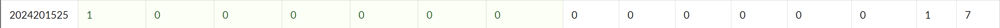

<!-- TODO: 用一个scoreboard的截图，本地图片，放到 imgs 文件夹下，不要用这个 github，pandoc 解析可能有问题 -->

## 解题报告

<!-- 对你拆掉的每个phase进行分析，并写出你得出答案的历程 -->

<!-- 如果能用伪代码还原题目源代码最佳（不属于先前提到的大段代码），语言描述自己的分析也可，每道题目的图片不建议超过两张 -->

### phase_1

```c
Zuorhi viyantas was festsu ruor proi, yuk dalfe suoivo swenne yat vu henvi nes.
```

题目思路：
- 输入一个字符串(input)
- 查看rsi寄存器中存储的地址处的字符串为：Zuorhi viyantas was festsu ruor proi, yuk dalfe suoivo swenne yat vu henvi nes.
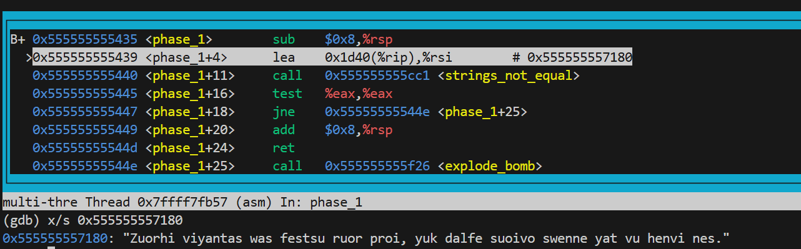
- call <strings_not_equal>:比较输入的字符串与rsi寄存器存储的地址处的字符串是否相等，返回值存在eax寄存器中
- %eax & %eax:
  - 如果ZF为0，即%eax=1，strings_not_equal返回值为真，两个字符串不相等，就会跳到phase_1+0x19=144e处，为explode_bomb，导致炸弹爆炸；
  - 如果ZF为1，即%eax=0，strings_not_equal返回值为假，两个字符串相等，就会继续向下进行，返回到主函数，成功拆除炸弹
- 因此，输入要与rsi寄存器存储的地址处的字符串相同，即为Zuorhi viyantas was festsu ruor proi, yuk dalfe suoivo swenne yat vu henvi nes.，才能拆除phase_1炸弹

伪代码：
```c
  result="Zuorhi viyantas was festsu ruor proi, yuk dalfe suoivo swenne yat vu henvi nes.";
  string s;
  cin>>s;
  if(s!=result){
    explode_bomb();
  }
  return;
```


### phase_2

```c
246777 320296 816177 605091
```

题目思路:
- 查看rsi寄存器中存储的地址处的字符串，为"%d %d %d %d"
- call <__isoc99_sscanf@plt>,为按"%d %d %d %d"的方式读输入的内容，返回值存储在寄存器%eax中，表示成功读取的个数
- cmp $0x4 %eax->%eax-$0x4：
  - 如果ZF=0，即%eax！=4.跳转到phase_2+0x4d=14a2处，为explode_bomb，导致炸弹爆炸；
  - 如果ZF=1，即%eax=4，则继续进行->所以输入要为四个整数
- 接下来为一个2 × 3的矩阵与一个3 × 2的矩阵的乘法运算：
  - 每一行与一列的相乘中，%eax作为计数器，%ecx作为累加器，储存结果；
  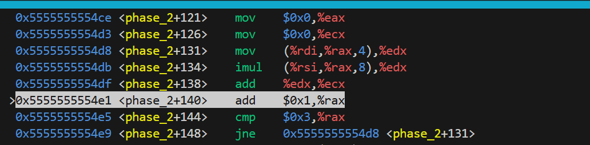
  - 假设%rdi中存储的是整数数组B的首地址，%rsi中存储的是整数数组A的首地址：
    - %r11d作为整体的计数器
    - %eax=0->%ecx=%ecx+b0×a0,%eax++;(注意%rdi和%rsi的值都不变，仍然指向首地址)
    - %eax=1->%ecx=%ecx+b1×a2,%eax++;
    - %eax=2->%ecx=%ecx+b2×a4,%eax++;
    - %eax==3,不再继续循环，往下继续进行，记录最后%ecx中存储的值(246777)；
    - %r8d++,但仍小于2，相当于继续用B的第一行运算，而%rsi=%rsi+4，%rsi现在指向a1；
    - 又将%eax置0，来到上述循环，最终得到%ecx=b0×a1+b1×a3+b2×a5(320296);
    - 此时%r8d==2，无条件跳转到phase_2+0x54=14a9处，%rdi=%rdi+0xc,%rdi现在指向b3，并重置%rsi，使之重新指向a0，然后执行上述相同的步骤；
    - 之后%r11d==2,结束矩阵乘；
    - 可以看出，这是：
            $$
            \begin{bmatrix}
            b_0 & b_1 & b_2 \\
            b_3 & b_4 & b_5
            \end{bmatrix}
            \times
            \begin{bmatrix}
            a_0 & a_1 \\
            a_2 & a_3 \\
            a_4 & a_5
            \end{bmatrix}
            $$
  - 将输入的四个数字与矩阵相乘得到的数字一一比较：
    - 如果相等，继续比较；
    - 如果不相等，call explode_bomb；
  - 直到四个数都比较完了，返回到主函数，成功拆除炸弹；
伪代码：
```c
  int c[4];
  if(!sscanf("%d %d %d %d",&c[0],&c[1],&c[2],&c[3])){
    explode_bomb();
  }
  int sum[4]={0};
  for(int k=0;k<2;k=k+1){
    for(int i=0;i<2;i=i+1){
        for(int j=0;j<3;j=j+1){
            sum[k*2+i]=sum[k*2+i]+B[k*2+j]*A[j*2+i];
        }
    }
  }
  for(int i=0;i<3;i=i+1){
    if(c[i]!=sum[i]){
        explode_bomb();
    }
  }
  return;
```

### phase_3

```c
5 -235
```

题目思路：
- <__isoc99_sscanf@plt>函数需要输入两个整数“%d %d”--如果输入数字少于两个，炸弹爆炸
```c
  1568:	e8 e3 fb ff ff       	call   1150 <__isoc99_sscanf@plt>
  156d:	83 f8 01             	cmp    $0x1,%eax
  1570:	7e 07                	jle    1579 <phase_3+0x35>
  1572:	83 7c 24 04 00       	cmpl   $0x0,0x4(%rsp)
  1577:	78 05                	js     157e <phase_3+0x3a>
  1579:	e8 a8 09 00 00       	call   1f26 <explode_bomb>
```
- 调用完函数sscanf之后，(%rsp)->输入的第一个数a，(%rsp+4)->输入的第二个数b
- js->如果sign flag为1则跳转：如果b小于零，则sign flag为1，跳转；如果b不小于零，则继续执行，则炸弹爆炸->第二个参数b要小于0
```c
  1572:	83 7c 24 04 00       	cmpl   $0x0,0x4(%rsp)
  1577:	78 05                	js     157e <phase_3+0x3a>
  1579:	e8 a8 09 00 00       	call   1f26 <explode_bomb>
```
- 跳转后比较a与7的大小，如果a>7，则跳转到phase_3+0xde=0x1622，炸弹爆炸，所以a<=7；
- 将%rdx赋值为%rip+0x1c9e，查看此地址处的值，得到：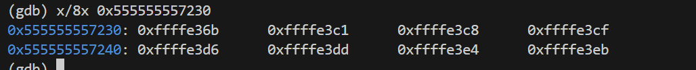
- 接下来，将%rdx地址后第a个数赋给rax，然后再与%rdx相加，得到一个新地址，并跳转到这个位置；发现跳转到的每个位置之间间隔七个字节，并且对%eax或者%ebx进行相应赋值后又跳转到一个新位置；有此对应表：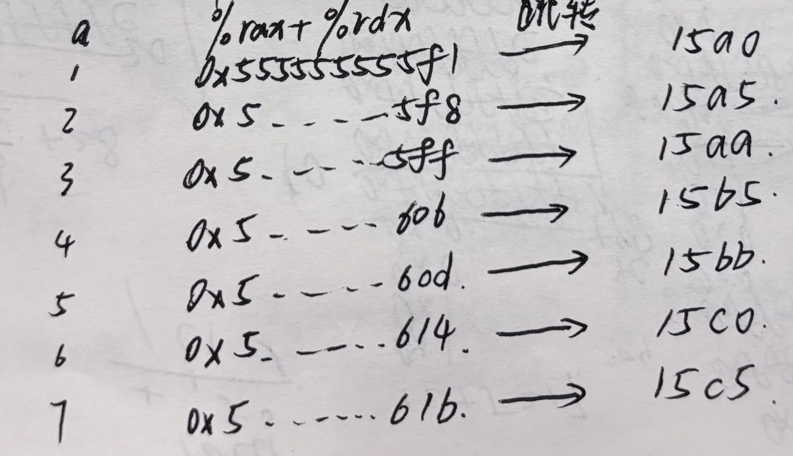
- 发现15a0，15a5，15aa都会到达explode_bomb,则a不为1，2，3；
- 15ca行，如果a>5，跳转到phase_3+0x92=15d6，炸弹爆炸，则a<=5；
- a=4时，%ebx=0，跳转到15b5->经过三次对%eax的加减操作，得到%eax=0；
- a=5时，%eax=0，跳转到15bb->经过三次对%eax的加减操作，得到%eax=-0xeb；
```c
  15d0:	39 44 24 04          	cmp    %eax,0x4(%rsp)
  15d4:	74 05                	je     15db <phase_3+0x97>
  15d6:	e8 4b 09 00 00       	call   1f26 <explode_bomb>
```
- b必须等于%eax，跳转到phase_3+0x97=15db，并于15f0处返回，否则炸弹爆炸：
  - 当a=4时，b=0，与b<0矛盾；
  - 当a=5时，b=-0xeb=-235，符合，因此第二个数b=-235
- 因此输入的两个数为5 -235

### phase_4

```c
31 BA
```
题目思路：
- 这个phase是根据代码的逻辑，得到对应的值，然后逆推出答案，其中并不需要根据输入的数据得出某些结果
- 输入：
  - sscanf第二个参数%rsi为“%d %2s”;
  - 如果输入的不是两部分，即%eax≠2->跳到178f，炸弹爆炸；
  - 因此输入为一个整数和一个字符串；
```c
  1707:	48 8d 4c 24 10       	lea    0x10(%rsp),%rcx
  170c:	48 8d 54 24 0c       	lea    0xc(%rsp),%rdx
  1711:	48 8d 35 ed 1a 00 00 	lea    0x1aed(%rip),%rsi        # 3205 <_IO_stdin_used+0x205>
  1718:	e8 33 fa ff ff       	call   1150 <__isoc99_sscanf@plt>
  171d:	83 f8 02             	cmp    $0x2,%eax
  1720:	75 6d                	jne    178f <phase_4+0x9d>
```
- %edi赋值为5，call func4_1,func4_1为一个递归函数，伪代码如下：
```c
func4_1(edi){
  if(edi<=0){
    return 0;
  }
  else if(edi==1){
    return 1;
  }
  else{
    return 2*func4_1(edi-1)+1;
  }
}
```
- 因为%edi的值为5，因此func4_1返回的值为31，存在%eax中；将%eax与0xc(%rsp)（输入的第一个整数）比较，如果不相等->跳到1796，炸弹爆炸，因此输入的第一个整数要为31；
- 输入的第二个字符串的长度要为2，如果不为2->跳到179d，炸弹爆炸；
- func4_2伪代码如下：
```c
func4_2(edi,esi,edx('A'),ecx('C'),r8('B'),r9){
  r12d=edx;
  r13d=ecx;
  rbp=r9;//保存寄存器
  if(edi==1){
    rbp[0]=dl;
    rbp[1]=cl;
    rbp[2]=0;
    return;
  }
  ebx=esi;
  r14d=r8d;
  r15d=edi-1;
  edi=r15d;
  int temp=func4_1(edi);
  if(temp>=ebx){
    func4_2(r15d,ebx,r12b,r14b,r13b,rbp);
    return;
  }
  else{
    edx=temp+1;
    if(edx!=ebx){
      esi=rbx-1;
      func4_2(r15d,esi,r14b,r13b,r12b,rbp);
      return;
    }
    else{
      rbp[0]=r12b;
      rbp[1]=r13b;
      rbp[2]=0;
      return;
    }
  }
}
```
- 调用完func4_2函数之后，将%rsp+0x10赋值给%rdi，即输入的第二个字符串的首地址；
- 将%rbx（%rsp+0x14）赋值给%rsi，则%rsi存的地址处为经过func4_2函数放入的字符串；
- 调用strings_not_equal(edi,esi)，比较这两个地址处的字符串是否相同：
  - 如果不相同，%eax=1，%eax&%eax=1，跳转到17a4，炸弹爆炸；
  - 相同，%eax=0，%eax&%eax=0，顺利返回，拆弹成功；
  - 因此输入的字符串要与%rsi存的地址处的字符串相同；
- 查看%rsi存的地址处的字符串，可知输入的第二个字符串应该为BA；
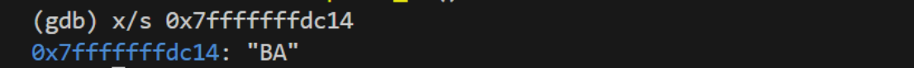

### phase_5

```c
jpofgh
```
题目思路：
- 输入长度：如果长度不为6，跳转到182a，炸弹爆炸，因此输入的长度应该为6；
```c
  17c8:	e8 d7 04 00 00       	call   1ca4 <string_length>
  17cd:	83 f8 06             	cmp    $0x6,%eax  
  17d0:	75 58                	jne    182a <phase_5+0x7a>
```
- 查看%rcx存的地址处的字符串：
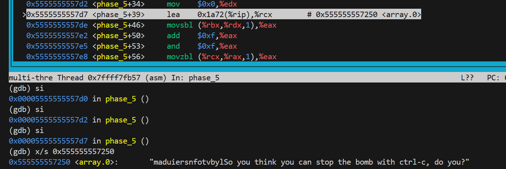
- %edx作为计数器，%rbx->存储的为输入的字符串的地址，17de~17f8为一个循环，伪代码如下：
```c
rdx=0；
while(rdx!=6){
  eax=rbx[rdx];
  eax=(eax+0xf)&0xf;
  eax=rcx[rax];
  rsp[rdx+1]=al;
  rdx++;
}
```
- 这个函数的目的是，依次取输入字符串中的每个字符，将其加上0xf再&0xf（将字符的阿斯克码值加上0xf后取后四位），得到的结果记为num，然后将rcx那一串字符中num位置的字符取出来，压入栈中；
- 循环结束后，将获得的六个数字都存在了栈中，从rsp[1]开始,到rsp[6],并将rsp[7]置为0，作为这六个数字组成的字符串的结尾；
- 将得到的字符串的首地址赋值给%rdi，再读取一个目标字符串到%rsi，查看%rsi存的地址处的字符串为“flyers”
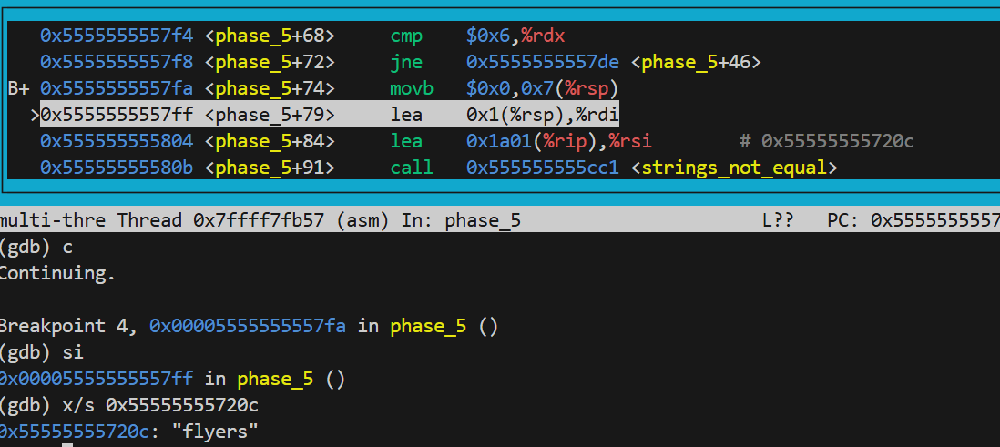
- 调用函数strings_not_equal(rdi,rsi),比较这两个字符串是否相同，如果不相同，%eax为1，跳转到1831，炸弹爆炸，因此要使这两个字符串相等；
- 逆推：
  - f在rcx存的地址处的那一串字符串(array.0)的下标为9，假设输入的第一个字符为x，则x+0xf的后四位要为9，x的后四位应为0x9-0xf=0xa，查阿斯克码表可知j的阿斯克码十六进制表示为0x4a，后四位为0xa满足条件；
  - 以此类推，得到剩下的五个字符可以为pofgh（答案不止一种，满足条件即可）；

### phase_6

```c
4 1 6 2 3 5
```
题目思路：
- 输入长度：调用函数read_six_numbers，读入六个数字，说明输入为6个数字；
- 跳转到1944，接下来有一个循环，目的是为了检查输入的数字，伪代码：
```c
  r15d=1;
  rbp=r14=r13=input；//输入数字的首地址
  while(r15d<=5){
    eax=r14[0];
    eax=eax-1;
    if(eax>5){
      explode_bomb();
    }
    rbx=r15d;
    while(rbx<=5){
      eax=r13[rbx];
      if(rbp[0]==eax){
        explode_bomb();
      }
      rbx++;
    }
    if(rbx>5){
      r15++;
      r14=r14+4//=*r14[1]
      rbp=r14;
    }
  }
  jump line_18a6;
```
- 这段代码的目的是为了：
  - 检查输入的数字是否小于等于(<=)6；
  - 检查数字是否互不相同，如果有相同的数字就会导致炸弹爆炸；
- 检查完之后，跳转到18a6，对输入的数字做一次变化，伪代码为：
```c
  r12=0x7fffffffdb90;
  rdx=0x7fffffffdba8;
  ecx=7;
  eax=7;
  while(r12!=rdx){
    eax=ecx;//7
    eax=eax-r12[0];
    r12[0]=eax;//=7-r12[0]
    r12=r12+4;//*r12[1]
  }
```
- 这段代码的目的：
  - 将输入的数字都变为7减去原来的数字;
- 查看%rdx存储的地址处的内容，即node的内容->发现这些节点类似一个链表，node存储的为节点的数据，node+8为指针域，存储的是下一个节点的地址：
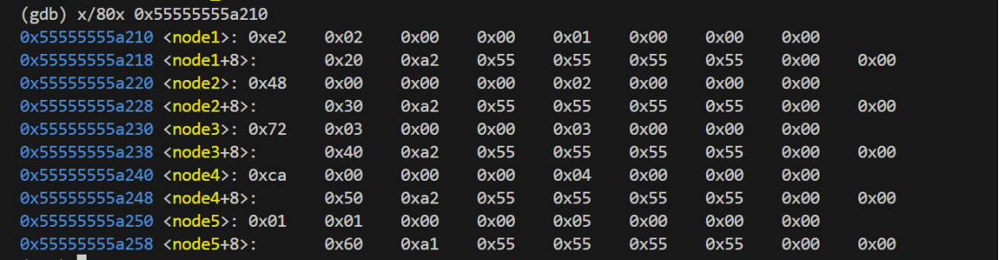
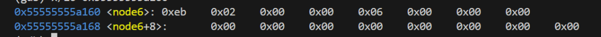
- 然后，将这个链表的每个节点的地址按照一定的规则压到栈中，伪代码为：
```c
  store=rsp+0x30;//store中每个单元存一个地址（占8个字节）
  esi=0;
  while(rsi!=6){
    ecx=input[rsi];
    eax=1;
    rdx=node1;
    if(ecx<=1){
      store[rsi]=rdx;
      rsi++;
    }
    else{
      while(eax!=ecx){
        rdx=(%rdx+8)=rdx.next//就是下一个节点的地址
        eax++;
      }
      store[rsi]=rdx;
      rsi++;
    }
  }
```
- 这段代码的目的：
  - 依次将数字对应的节点的地址压入栈中（从%rsp+0x30开始），即数字是x，就将nodex的地址压入栈中
- 接下来，将链表中的节点重新排序，顺序为压入栈中的顺序，从栈的下方到上方，依次将节点连城一个新的链表，最后一个节点的指针指向0；
```c
    18fb:	48 8b 5c 24 30       	mov    0x30(%rsp),%rbx
    1900:	48 8b 44 24 38       	mov    0x38(%rsp),%rax
    1905:	48 89 43 08          	mov    %rax,0x8(%rbx)
    1909:	48 8b 54 24 40       	mov    0x40(%rsp),%rdx
    190e:	48 89 50 08          	mov    %rdx,0x8(%rax)
    1912:	48 8b 44 24 48       	mov    0x48(%rsp),%rax
    1917:	48 89 42 08          	mov    %rax,0x8(%rdx)
    191b:	48 8b 54 24 50       	mov    0x50(%rsp),%rdx
    1920:	48 89 50 08          	mov    %rdx,0x8(%rax)
    1924:	48 8b 44 24 58       	mov    0x58(%rsp),%rax
    1929:	48 89 42 08          	mov    %rax,0x8(%rdx)
    192d:	48 c7 40 08 00 00 00 	movq   $0x0,0x8(%rax)
```
- 跳转到1971，将每个节点与其后面的一个节点的值进行比较，如果前一个节点的值（低32位）>=后一个节点的值（低32位）->跳转，否则炸弹爆炸，伪代码：
```c
ebp=5;
while(ebp!=0){
  rax=rbx[0].next;
  eax=rax.value;//取rax地址处的低32位
  if(rbx[0].value<eax){//rbx地址处的低32位与eax比较
    explode_bomb();
  }
  rbx=rbx[0].next;//rbx指向下一个node
  ebp=ebp-1;
}
```
- 因此，所有结点的值要按照大小逆序排列（从大到小），根据每个节点存储的值（node1:0x02e2,node2:0x48,node3:0x0372,node4:0xca,node5:0x0101,node6:0x02eb），最后链表的顺序为node3->node6->node1->node5->node4->node2;
  - 所以变化后的数字序列为：3 6 1 5 4 2
  - 由于这些数字是被7减去后得到的，则最开始输入的数字为：4 1 6 2 3 5

### secret_phase

```c
进入：enigma
答案：33113
```

题目思路：
- 如何进入到secret_phase：
  - 注意到phase_defused可能会调用secret_phase；
  - 比较输入的字符串数量（num_input_strings），如果不等于6，则直接return，只有等于6时，才会进一步进入到函数内部，观察我们的答案可知，只有phase_6的答案是6个字符串（6个数字），因此进入secret_phase的方式可能是通过phase_6；
  - 然后，为了能够验证输入的这个字符串是否是正确的，要找到这个字符串开始的首地址，也就是要将前面输入的6个内容跳过去，伪代码：
```c
  eax=1;
  edx=0;
  ecx=rdi；//为phase_6输入的6个数字的首地址
  while(edx<=5){
    if(cl==0x20){//相等，ZF=1；
      cl=1;
    }
    else{
      cl=0;
    }
    edx=edx+ecx;//只有当ecx=1时，edx才会增大
    esi=eax;
    ecx=rid[rax];
    rax++;
    if(edx>5){
      jump 21b7;
    }
  }
```
  - 从代码可以看出来只有当ecx=1时，即cl=0x20（阿斯克码对应的字符为空格），即遇到空格时，edx才会增大，因此这段代码的作用是跳过空格
    - 如果跳过5个空格，edx=5，继续进行输出两个提示后，return，不能进入到secret_phase；
    - 当edx=6，即跳过6个空格时，才能继续深入；
    - 而phase_6的答案中只有5个空格，因此要进入secret_phase就要在phase_6的答案后面再加上一个空格后输入一串数据；
  - 跳转到21d6，将phase_6答案的首地址赋值给rax，再将rdi赋值为rax+rsi（rsi为0xc，即为phase_6的6个字符+6个空格），即rdi为输入进入secret_phase的口令的首地址；
  - 查看rsi存的地址处的字符串，为“enigma”：
  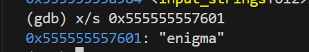
  - 调用函数strings_not_equal（edi，esi），比较这两个字符串是否相同：
    - 如果输入的字符串不为enigma，eax=1，跳转到21bc，输出两个提示后，return，不能进入到secret_phase；
    - 因此输入的字符要为enigma，eax=0，不跳转，会继续运行到2211，call secret_phase，成功进入到secret_phase;
  - 因此，要进入secret_phase，就要在phase_6的答案之后加上 enigam.
- secret_phase:是一个国际象棋中马走日的路径问题
  - 提示：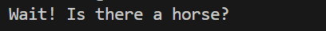
  - 输入：一个字符串，如果长度>0x14，则跳到1c1d，炸弹爆炸，因此输入的字符串长度应该<=0x14;
  - call func7(edi=input,esi=0,edx=0,ecx=0);
    - 棋子的出发位置为（esi，edx）->（0，0），目的位置为（4，7）；
    - 首先，将许多数字压入了栈中，为后面的操作做准备->压入后栈的示意图如下：
    ```c
    ↓ 栈底（高地址）
    │ 0   (0)      ← 0x7c(%rsp)
    │ -1  (-1)     ← 0x78(%rsp)
    │ -1  (-1)     ← 0x74(%rsp)
    │ 0   (0)      ← 0x70(%rsp)
    │ 0   (0)      ← 0x6c(%rsp)
    │ 1   (1)      ← 0x68(%rsp)
    │ 1   (1)      ← 0x64(%rsp)
    │ 0   (0)      ← 0x60(%rsp)
    │ -1  (-1)     ← 0x5c(%rsp)
    │ 0   (0)      ← 0x58(%rsp)
    │ 0   (0)      ← 0x54(%rsp)
    │ 1   (1)      ← 0x50(%rsp)
    │ 1   (1)      ← 0x4c(%rsp)
    │ 0   (0)      ← 0x48(%rsp)
    │ 0   (0)      ← 0x44(%rsp)
    │ -1  (-1)     ← 0x40(%rsp)
    │ -1  (-1)     ← 0x3c(%rsp)
    │ -2  (-2)     ← 0x38(%rsp)
    │ -2  (-2)     ← 0x34(%rsp)
    │ -1  (-1)     ← 0x30(%rsp)
    │ 1   (1)      ← 0x2c(%rsp)
    │ 2   (2)      ← 0x28(%rsp)
    │ 2   (2)      ← 0x24(%rsp)
    │ 1   (1)      ← 0x20(%rsp)
    │ -2  (-2)     ← 0x1c(%rsp)
    │ -1  (-1)     ← 0x18(%rsp)
    │ 1   (1)      ← 0x14(%rsp)
    │ 2   (2)      ← 0x10(%rsp)
    │ 2   (2)      ← 0x0c(%rsp)
    │ 1   (1)      ← 0x08(%rsp)
    │ -1  (-1)     ← 0x04(%rsp)
    │ -2  (-2)     ← 0x00(%rsp)
    ↑ 栈顶（低地址）
    ```
    - 对输入数据的处理，依次取每一个字符，但只保留其后三位：
    ```c
    1aea:	41 89 f2             	mov    %esi,%r10d
    1aed:	41 83 e2 07          	and    $0x7,%r10d
    1af1:	83 e6 07             	and    $0x7,%esi
    ```
    - (%rsp)~(%rsp+0x1c)和(%rsp+0x20)~(%rsp+0x3c)两两对应，8种跳法，对应棋子在棋盘上移动的方向和距离->(x,y)
      - 更新棋子位置并验证位置是否合法（有没有超出棋盘），伪代码：
      ```c
        eax=x;
        r10d=esi=input[rcx];
        r10d=r10d&0x7;
        esi=esi&0x7;
        r8d=eax=x;
        r8d=x+(%rsp+4*%rsi);//更新后的x
        r11d=edx=y;
        r11d=y+(%rsp+4*%rsi+0x20);//更新后的y
        esi=r8d;//新的x
        esi=esi|raad;
        ecx=0;
        if((unsigned)esi>0x7){
          return;
        }
      ```
      - 因为比较时要把esi当作unsigned处理，因此如果x和y如果有一个为负数（unsigned很大）或者超出7，即不在我们棋盘的范围内，都会导致棋子还没达到目的地就错误返回了；
      - 如果新的位置在棋盘内，则跳转到1b52，继续之后的验证；
    - 查看棋盘（7*8）：
    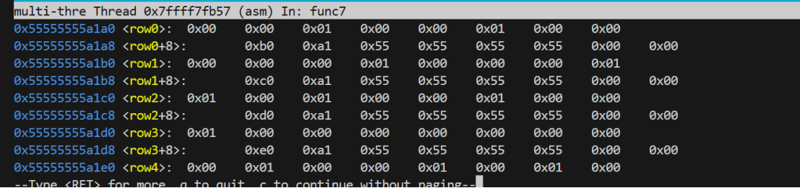
    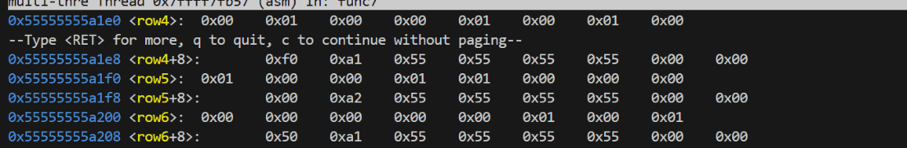
    - (%rsp+0x40)~(%rsp+0x5c)和(%rsp+0x60)~(%rsp+0x7c)一一对应，用来验证是否会蹩马腿，并和(%rsp)~(%rsp+0x1c)和(%rsp+0x20)~(%rsp+0x3c)的方向一一对应：
      - 因为马走日可以分解成两步：先走一直，再走一斜，蹩马腿的含义为：如果在要去的方向，正前方的第一格，有别的棋子挡住，马就无法走过去，俗称“蹩马腿 ”；
      - 因此，从栈中，我们获得了如下的对应关系：
      ```c
        0x00(%rsp): -2  (dx0)      0x20(%rsp): 1   (dy0)      0x40(%rsp): -1  (block_dx0)  0x60(%rsp): 0   (block_dy0)
        0x04(%rsp): -1  (dx1)      0x24(%rsp): 2   (dy1)      0x44(%rsp): 0   (block_dx1)  0x64(%rsp): 1   (block_dy1)
        0x08(%rsp): 1   (dx2)      0x28(%rsp): 2   (dy2)      0x48(%rsp): 0   (block_dx2)  0x68(%rsp): 1   (block_dy2)
        0x0c(%rsp): 2   (dx3)      0x2c(%rsp): 1   (dy3)      0x4c(%rsp): 1   (block_dx3)  0x6c(%rsp): 0   (block_dy3)
        0x10(%rsp): 2   (dx4)      0x30(%rsp): -1  (dy4)      0x50(%rsp): 1   (block_dx4)  0x70(%rsp): 0   (block_dy4)
        0x14(%rsp): 1   (dx5)      0x34(%rsp): -2  (dy5)      0x54(%rsp): 0   (block_dx5)  0x74(%rsp): -1  (block_dy5)
        0x18(%rsp): -1  (dx6)      0x38(%rsp): -2  (dy6)      0x58(%rsp): 0   (block_dx6)  0x78(%rsp): -1  (block_dy6)
        0x1c(%rsp): -2  (dx7)      0x3c(%rsp): -1  (dy7)      0x5c(%rsp): -1   (block_dx7)  0x7c(%rsp): 0  (block_dy7)
      ```
      - 从中可以发现，棋子可以走8个方向，每两个方向对应一个检查蹩马腿的方向，即：
      ```c
        方向x->对应输入的字符的后三位为x;
        方向7(-2,-1): 蹩马腿(-1,0)  
        方向0(-2,1): 蹩马腿(-1,0)   // 👈检查棋子左边一格是否被占用
        方向1(-1,2): 蹩马腿(0,1)    
        方向2(1,2): 蹩马腿(0,1)     // 👆检查棋子上边一格是否被占用
        方向3(2,1): 蹩马腿(1,0)      
        方向4(2,-1): 蹩马腿(1,0)    // 👉检查棋子右边一格是否被占用
        方向5(1,-2): 蹩马腿(0,-1)     
        方向6(-1,-2): 蹩马腿(0,-1)  // 👇检查棋子下边一格是否被占用
      ```
      - %eax对应的是移动时可能会蹩马腿的点的行坐标，edx对应的是纵坐标，找到这个点后验证其是否为1，如果为1，说明有其他棋子占用，蹩马腿，会提前返回，不能跳；否则可以跳，伪代码：
      ```c
        eax=dx;
        edx=dy;
        ecx=0;
        rsi=*block;//第一行的首地址
        if(eax<=0){//如果eax=0，说明就在第一行，行的位置不用变
          rdx=edx;
          ecx=0;
          if(rsi[rdx]==1){
            return;
          }
        }
        else{
          while(ecx!=eax){//循环找到对应的行
            rsi=rsi.next_row;
            ecx++;
          }
          edx=edx;
          ecx=0;
          if(rsi[rdx]==1){//找到对应的列
            return;
          }
        }
      ```
    - 如果不蹩马腿，则可以向这个方向跳，接下来检查跳的目的地是否有其他棋子，如果有其他棋子占用，会提前返回，也不能跳；否则可以跳，伪代码：
    ```c
    rdx=*block;//第一行的首地址
    r8d=new_x;//更新后（跳到的位置）的行;
    r11d=new_y;//更新后（跳到的位置）的列
    if(r8d<=0){
      rax=r11d;
      ecx=0;
      if(rdx[rax]){
        return;
      }
    }
    else{
      eax=0;
      while(eax!=r8d){
        rdx=rdx.next_row;
        eax++;
      }
      rax=r11d;
      ecx=0;
      if(rdx[rax]==1){
        return;
      }
    }
    ```
    - 如果目的地也没有其他棋子占用，可以跳，则会进行下一步的移动，再次调用func7(edi,new_x,new_y,ecx++),即验证输入的第二个字符对应的方向是否可以走;
    - 如果最后走到了目的地，就会给%ecx赋值为0x1，然后跳转到1b13，将%ecx的值赋值给%eax，使func7返回1：
    ```c
      1ac4:	83 fe 04             	cmp    $0x4,%esi
      1ac7:	75 6b                	jne    1b34 <func7+0x18e>
      1ac9:	83 fa 07             	cmp    $0x7,%edx
      1acc:	75 66                	jne    1b34 <func7+0x18e>
      1ace:	49 63 c9             	movslq %r9d,%rcx
      1ad1:	0f b6 34 0f          	movzbl (%rdi,%rcx,1),%esi
      1ad5:	b9 01 00 00 00       	mov    $0x1,%ecx
      1ada:	40 84 f6             	test   %sil,%sil
      1add:	74 34                	je     1b13 <func7+0x16d>
      1b13:	48 8b 84 24 88 00 00 	mov    0x88(%rsp),%rax
      1b1a:	00 
      1b1b:	64 48 2b 04 25 28 00 	sub    %fs:0x28,%rax
      1b22:	00 00 
      1b24:	0f 85 9e 00 00 00    	jne    1bc8 <func7+0x222>
      1b2a:	89 c8                	mov    %ecx,%eax
      1b2c:	48 81 c4 98 00 00 00 	add    $0x98,%rsp
      1b33:	c3                   	ret
    ```
  - 回到secret_phase，检查func7的返回值%rax，如果%eax为0，跳转到1c24，炸弹爆炸，因此func7的返回值必须为1；
  - 即要使棋子在0x14步之内，从（0，0）移动到（4，7），输入的字符即按照上述关系对应到每一步移动，要找出一条正确的路径，使棋子正确抵达终点；
  - 因此路径可以为(0,0)->(2,1)->(4,2)->(3,4)->(2,6)->(4,7),对应的移动方向为(2,1)->(2,1)->(-1,2)->(-1,2)->(2,1),对应的输入为33113（因为0~7数字对应的阿斯克码的十六进制的后3位就为它本身）。
## 反馈/收获/感悟/总结

- 通过拆弹来帮助我们理解汇编代码的形式很新颖很有趣；
- 这个实验可以帮助我们很全面的巩固汇编的知识，很有收获；
- 通过这个实验也初步学会了使用gdb；
- （应该拆完一个炸弹就立马写出这个炸弹的解题步骤，拆完很久再写解题思路像是又重新拆了一遍炸弹；

## 参考的重要资料

<!-- 有哪些文章/论文/PPT/课本对你的实现有重要启发或者帮助，或者是你直接引用了某个方法 -->

<!-- 请附上文章标题和可访问的网页路径 -->
